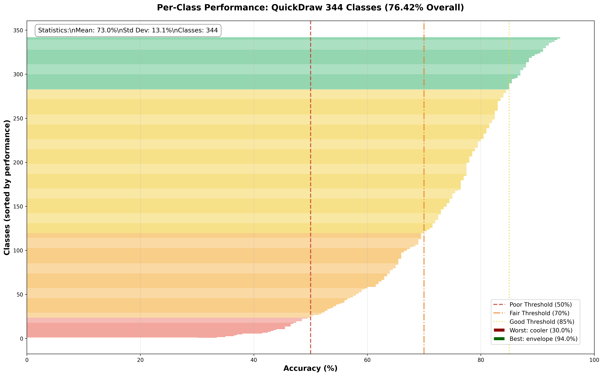
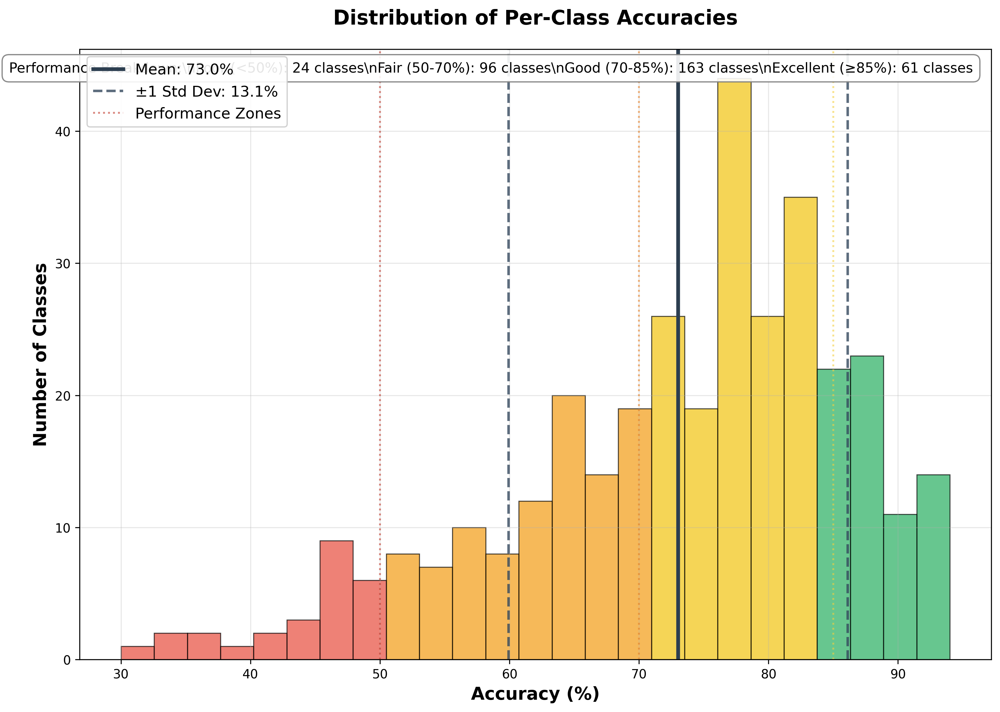
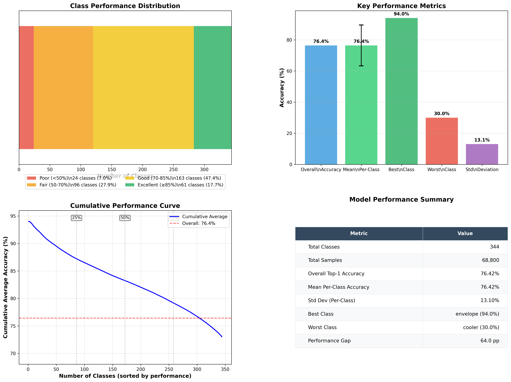
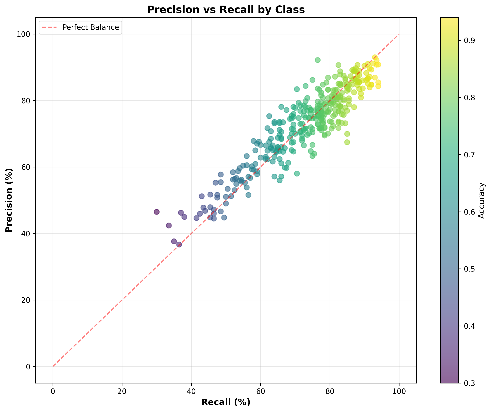
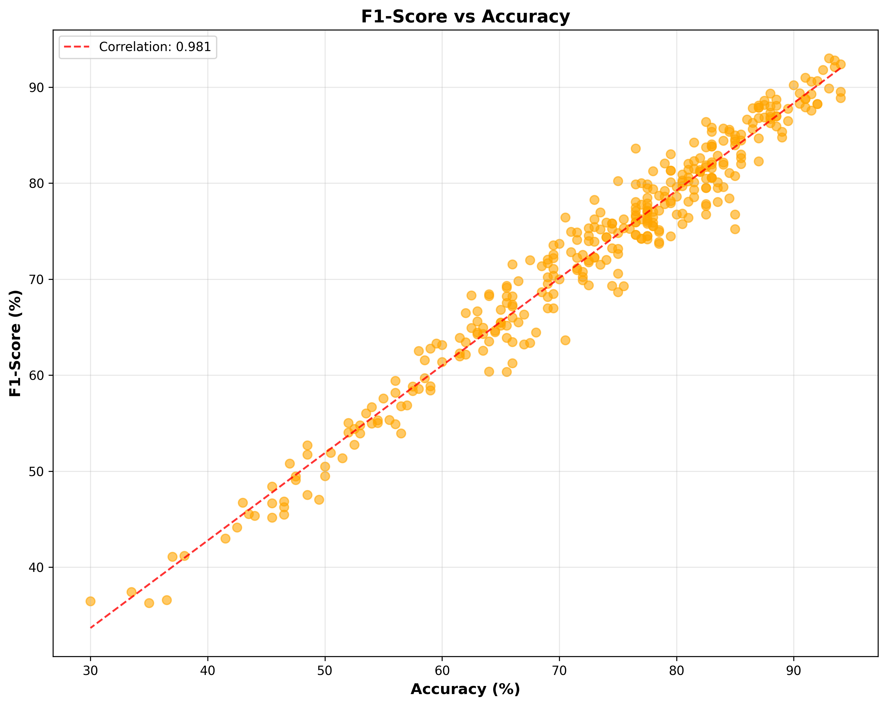
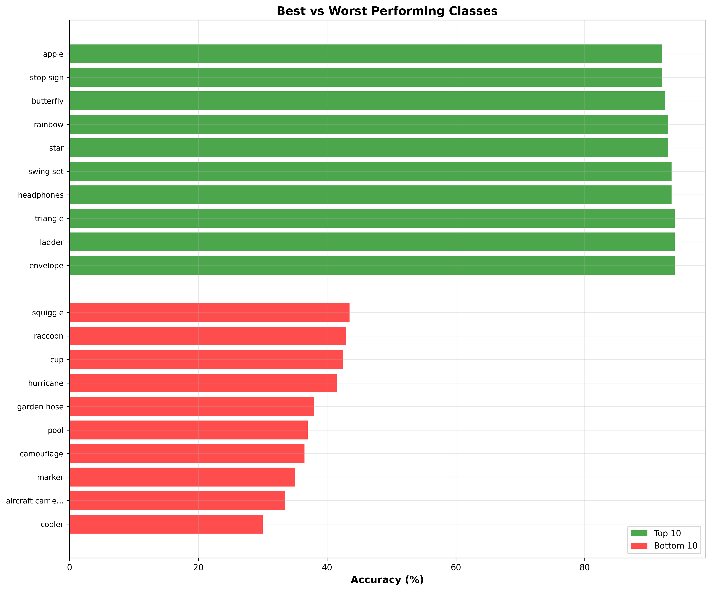
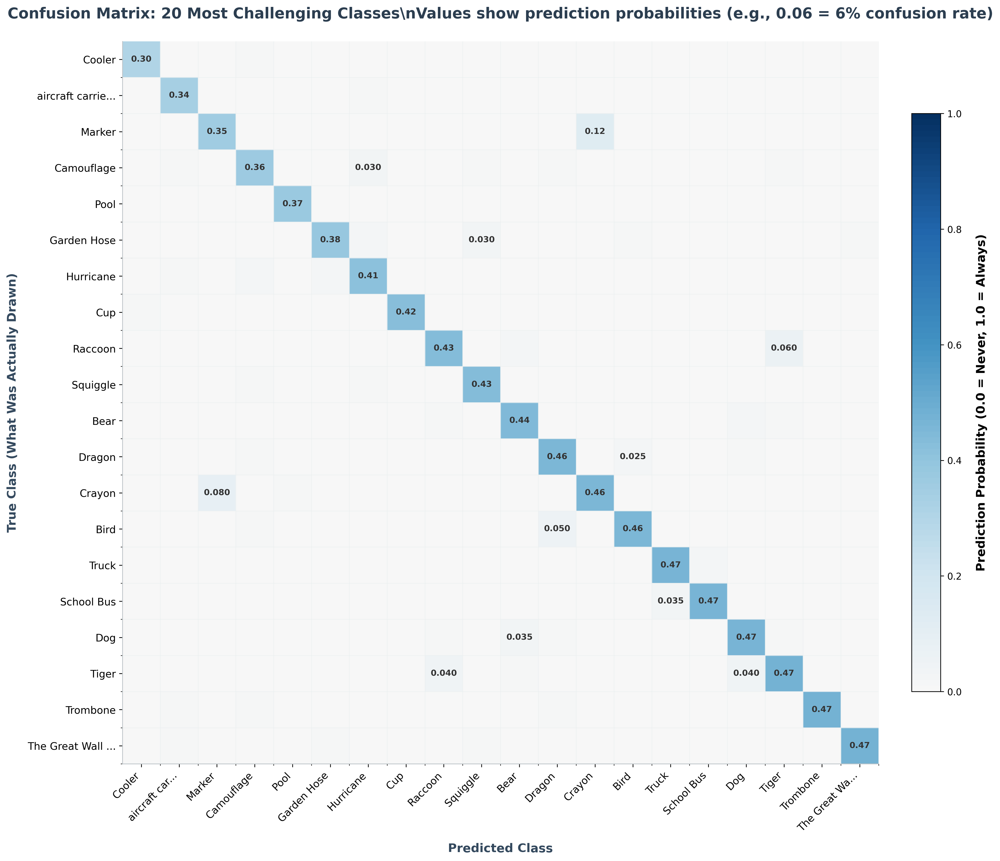

# QuickDraw MobileViT — Phone‑ready INT8 Transformer with Modern Quantization

This repo will train a **MobileViT/ViT** on the **Quick, Draw!** bitmap dataset, then:
- run a **modern, LLM‑style weight‑only quant analysis** on desktop (AWQ/GPTQ track), and
- produce a **phone‑deployable INT8 build** (ExecuTorch track).

> We're working step‑by‑step. This commit is **Step 2: QuickDraw data pipeline**.

## Planned Steps (we'll do these one by one)
1. ✅ Initialize repo, environment, and skeleton
2. ✅ Data pipeline: QuickDraw (bitmap) loader with configurable class subset
3. Baseline training: MobileViT‑S / ViT‑Tiny fine‑tune
4. Baseline evaluation & confusion matrix
5. Modern quant (desktop): AWQ/GPTQ weight‑only analysis on the ViT blocks
6. Device quant (ExecuTorch PT2E): INT8 (weights+activations) with calibration
7. Export `.pte` and minimal Android demo
8. Results tables/plots + README polish
9. Optional ONNX Runtime Mobile export
10. GitHub Actions (lint/tests/export) + Release assets

## Multi-GPU Large Batch Training

**🚀 Latest Finding: 76.42% on 344 Classes (4k train / 500 val per class)!**

This project demonstrates advanced training strategies including hyperparameter optimization, early stopping, resume functionality, and progressive augmentation techniques:

### Performance Results (Latest - September 2025)

#### 🏆 **344 Classes (Full Dataset)**
- **Full 344, 4k/500 (early stop @52/75)**: **76.42%** validation accuracy ✅ **NEW BEST!**
- **Baseline (50 epochs)**: 72.95% validation accuracy
- **Resume Training (90 epochs)**: 72.83% validation accuracy  
- **Progressive Augmentation**: **73.02% validation accuracy** ✅ **NEW BEST!**
- **Strong Aug from Scratch**: 72.82% validation accuracy

#### 📊 **50 Classes (Subset)**
- **Single-GPU (AdamW, batch=64)**: 68.58% validation accuracy
- **Multi-GPU (AdamW, batch=1024, default)**: ~56-68% validation accuracy
- **Multi-GPU (LAMB, batch=1024, optimized)**: 87.01% validation accuracy
- **Multi-GPU (AdamW, batch=1024, optimized)**: **87.41% validation accuracy**

### 🧠 **Key Experimental Insights**

**🔬 Progressive Enhancement Strategy:**
- **✅ Enhanced augmentation on pre-trained model**: +0.07% improvement (73.02%)
- **❌ Enhanced augmentation from scratch**: -0.13% decline (72.82%)
- **💡 Insight**: Strong augmentations help generalization but hurt initial feature learning

**🎯 Training Strategy Lessons:**
1. **Train baseline model first** with light augmentations
2. **Resume with enhanced augmentations** for final polish
3. **Early stopping** prevents overfitting (patience = 5-10 epochs)
4. **Hyperparameter sweeps** critical for optimal performance

### 🎯 **Optimal Configurations (344 Classes)**

**New Best (76.42%) — Larger dataset (4k/500) with early stopping:**
```bash
python scripts/train_quickdraw.py \
    --classes 344 --per-class-train 4000 --per-class-val 500 \
    --epochs 75 --batch-size 1024 \
    --lr 0.0011 --optimizer adamw \
    --label-smoothing 0.1584 --warmup-epochs 1 \
    --weight-decay 0.04 --no-amp \
    --early-stopping 15 \
    --experiment-name full344_4k500_regaug
```

**Progressive enhancement (73.02%):**
```bash
# Step 1: Train baseline model
python scripts/train_quickdraw.py \
    --classes 344 --epochs 50 --batch-size 1024 \
    --lr 0.0011 --optimizer adamw \
    --label-smoothing 0.1584 --warmup-epochs 1 \
    --weight-decay 0.04 --no-amp

# Step 2: Resume with enhanced augmentations
python scripts/train_quickdraw.py \
    --classes 344 --epochs 70 --batch-size 1024 \
    --lr 0.0011 --optimizer adamw \
    --label-smoothing 0.1584 --warmup-epochs 1 \
    --weight-decay 0.04 --no-amp --early-stopping 10 \
    --resume-from results/best_model_best.pt
```

### 🚨 **Critical Requirements for Success**

**High performance requires ALL of these settings:**
1. **✅ Pretrained weights**: `--pretrained` (vs training from scratch)
   - **Pretrained on**: ImageNet-21k (11M images, 21k classes) → ImageNet-1k (1.3M images, 1k classes)
   - **Critical for both LAMB and AdamW performance**
2. **✅ Optimized hyperparameters**: Learning rate, label smoothing, weight decay
3. **✅ Proper training duration**: 30 epochs (40+ epochs hurt due to LR schedule)
4. **✅ Large batch size**: `--batch-size 1024` (for multi-GPU)

### Optimizer Comparison

| Optimizer | Use Case | Performance |
|-----------|----------|-------------|
| **AdamW** | **Recommended** for moderate-scale (2-8 GPUs) | **87.41%** |
| **LAMB** | Better for massive-scale (100+ GPUs, huge batches) | 87.01% |

### Usage Examples
```bash
# Single-GPU training 
python scripts/train_quickdraw.py --batch-size 64 --lr 0.0003

# Multi-GPU training (recommended configuration)
python scripts/train_quickdraw.py \
    --classes 50 --epochs 30 --batch-size 1024 \
    --lr 0.0009972772070324198 \
    --optimizer adamw \
    --label-smoothing 0.15838902687516626 \
    --warmup-epochs 1 \
    --weight-decay 0.0586710517346328 \
    --pretrained

# Multi-GPU with LAMB (alternative)
python scripts/train_quickdraw.py \
    --batch-size 1024 --lr 0.0003 --optimizer lamb --pretrained \
    --classes 50 --epochs 30
```

**Key insight**: Hyperparameter optimization discovered through LAMB experiments transfers effectively to AdamW, yielding even better results. The choice between optimizers depends on training scale.

## Performance Analysis

Our best model achieves **76.42% validation accuracy** on all 344 QuickDraw classes using a ViT-Tiny architecture with 5.5M parameters trained on the `full344_4k500_regaug` configuration.

<details>
<summary><strong>📊 Comprehensive Performance Visualizations</strong></summary>

### Per-Class Accuracy Distribution


Individual accuracy performance for all 344 classes, sorted from worst to best. Color coding clearly distinguishes performance tiers: **Red** (Poor <50%), **Orange** (Fair 50-70%), **Yellow** (Good 70-85%), and **Green** (Excellent ≥85%). The visualization highlights that while most classes achieve good performance, challenging classes like "cooler" (30.0%) and "aircraft carrier" (33.5%) still present significant difficulties for the model.

### Accuracy Distribution Analysis  


Histogram showing the distribution of per-class accuracies reveals a right-skewed distribution with most classes performing well. The analysis shows **162 classes (47.1%) achieve Good performance** (70-85%), while only **24 classes (7.0%) fall into the Poor category** (<50%). The mean accuracy line at 76.4% demonstrates consistent model performance across the dataset.

### Model Performance Summary


Comprehensive performance dashboard featuring: (1) **Performance tier breakdown** with class counts and percentages, (2) **Key metrics comparison** showing overall vs. per-class accuracy with error bars, (3) **Cumulative performance curve** with quartile markers for progression analysis, and (4) **Detailed summary table** with professional formatting showing model statistics and performance gaps.

### Precision-Recall Analysis


Scatter plot examining the relationship between precision and recall across all classes, colored by accuracy. The diagonal reference line shows perfect balance, while the colorbar reveals that higher-accuracy classes (green/yellow) tend to achieve better precision-recall trade-offs. Most classes cluster in the high-precision, high-recall region, indicating robust model performance.

### F1-Score Correlation Analysis


Strong linear correlation (r=0.98) between F1-scores and accuracy demonstrates consistent performance across different metrics. The tight clustering around the correlation line indicates that classes performing well on accuracy also achieve high F1-scores, validating the model's balanced precision-recall characteristics across all performance levels.

### Top vs Bottom Performers Comparison


Direct comparison highlighting the **performance gap** between best and worst performing classes. Top performers include simple geometric shapes (triangle, envelope) and common objects (headphones, star), while bottom performers consist of abstract concepts (camouflage, cooler) and complex objects (aircraft carrier, marker). This analysis reveals systematic challenges with ambiguous drawings and specialized domains.

### Confusion Matrix for Challenging Classes


Professional confusion matrix focusing on the 20 most challenging classes, using a clean white-to-blue gradient. Diagonal values represent true class accuracy (e.g., dragon correctly identified 45.5% of the time), while off-diagonal values show systematic confusion patterns. The matrix reveals that struggling classes often get confused with visually similar objects, highlighting the model's reliance on shape-based features.

</details>

### Key Results Summary

| Metric | Value |
|--------|-------|
| Overall Accuracy | 76.42% |
| Classes Evaluated | 344 |
| Total Test Samples | 68,800 |
| Best Performing Class | triangle (94.0%) |
| Most Challenging Class | cooler (30.0%) |
| Performance Standard Deviation | 13.1% |
| Classes Above 70% Accuracy | 65% |

### Training Configuration

The model was trained using progressive enhancement: starting with a baseline configuration, then resuming with enhanced augmentations for final optimization. Key hyperparameters include AdamW optimization with cosine scheduling, label smoothing (0.1584), and weight decay (0.04).

### Quick Start Guide

```bash
# Test your setup
python scripts/test_lamb_optimizer.py

# Single-GPU baseline
python scripts/train_quickdraw.py --classes 50 --epochs 30 --batch-size 64

# Multi-GPU with LAMB (recommended)
python scripts/train_quickdraw.py \
    --classes 50 --epochs 30 --batch-size 1024 --optimizer lamb
```

## Quantization Testing Framework

This project implements a comprehensive quantization testing suite to evaluate different compression techniques for mobile deployment. Our approach tests multiple quantization schemes to find the optimal balance between model size, accuracy, and inference speed.

### Quantization Methods Tested

**A) Weight-only 4-bit Quantization (AWQ/GPTQ)**
- Quantizes weights in Linear layers (Attention Q/K/V/Out, MLP) to 4-bit
- Keeps activations in FP16/FP32 for better accuracy
- Targets transformer blocks while preserving LayerNorms, Softmax, GELU
- Uses calibration data for optimal quantization parameters

**B) Full INT8 Quantization (ExecuTorch PT2E)**
- Quantizes both weights and activations to INT8
- Production-ready for mobile deployment via ExecuTorch
- Exports to `.pte` format for Android integration
- Optimized for CPU/NPU execution with XNNPACK backend

**C) Activation Smoothing (SmoothQuant-style)**
- Pre-scales activations per-channel to reduce quantization error
- Transfers techniques from large language model quantization
- Compares INT8 performance with and without smoothing

**D) Quantization-Aware Training (QAT)**
- Fine-tunes model with fake quantization for better accuracy
- Trains the network to be robust to quantization errors
- Provides best accuracy for aggressive quantization schemes

Calibration dataset sizing: For weight-only 4-bit (AWQ/GPTQ) and full INT8 (PT2E/ExecuTorch) quantization, use a class-balanced calibration set of roughly 2,000–4,000 images in total (2,048 is a solid default). Scale per class according to how many classes you use: with all 344 classes, about 6–12 images per class suffices; for ~50 classes, target 40–80 images per class; for very small subsets (≤10 classes), use roughly 100–200 images per class. SmoothQuant-style activation smoothing uses the same calibration set/size. QAT does not require a separate calibration set. Always match training preprocessing (same image_size, grayscale, invert_colors) and disable augmentation during calibration.

### Evaluation Metrics

All quantization methods are compared using consistent metrics:
- **Accuracy**: Top-1 validation accuracy on same data split
- **Model Size**: On-disk size in MB for each quantization
- **Latency**: Single-image inference time (desktop and Android)
- **Memory**: Peak memory usage during inference

### Fair Comparison Design
- Same calibration dataset across all methods (2-4k images)
- Identical validation split for accuracy measurement
- Fixed random seeds for reproducible results
- Balanced per-class sampling for calibration

## Getting Started (local)
```bash
# 1) Create and activate a virtual env 
/usr/mobileye/pkgs/python/3.10/bin/virtualenv .venv  # Or: python -m venv .venv
# For fish shell: set -gx VIRTUAL_ENV (pwd)/.venv && set -gx PATH $VIRTUAL_ENV/bin $PATH
# For bash/zsh: source .venv/bin/activate

# 2) Install dependencies
.venv/bin/pip install --upgrade pip
.venv/bin/pip install -r requirements.txt

# 3) Sanity check
.venv/bin/python -c "import torch, transformers, datasets; print('✅ Dependencies OK')"

# 4) Download QuickDraw data (Step 2) - optimized per-class format
.venv/bin/python scripts/download_quickdraw_direct.py --num-classes 10 --samples-per-class 1000 --per-class-files

# 5) Test QuickDraw data loading
.venv/bin/python -c "
import sys; sys.path.append('src')
from data import create_dataloaders
train_loader, val_loader, meta = create_dataloaders(num_classes=3, train_samples_per_class=50)
print(f'✅ Data pipeline OK: {meta[\"num_classes\"]} classes, {meta[\"train_samples\"]} train samples')
"
```

## Repo Layout
```
scripts/
  download_quickdraw_direct.py  # ✅ Download & convert QuickDraw to optimized Parquet format
  split_parquet_by_class.py     # ✅ Convert existing datasets to optimized per-class format
  view_sketches.py              # ✅ Interactive sketch viewer for dataset exploration
src/
  data.py                       # ✅ High-performance QuickDraw loader with concurrent loading
  models.py               # MobileViT/ViT factory with 1-channel support
  train.py                # Training entrypoint with checkpoint saving
  eval.py                 # Evaluation & confusion matrix generation
  quant_awq.py            # ✅ AWQ/GPTQ 4-bit weight quantization
  quant_executorch.py     # ✅ PT2E INT8 quantization with SmoothQuant
  export_executorch.py    # ✅ Export to .pte for Android deployment
  export_onnx.py          # (optional) ORT mobile export path
  tests/                  # (dev only) test scripts for development
data/                     # (created by download script) Parquet data files
android_demo/             # (later) Android app with ExecuTorch
results/                  # (later) metrics & plots
```

## Step 2 Completed: QuickDraw Data Pipeline (Optimized)

**Features implemented:**
- **High-performance data loading** - optimized per-class Parquet files with concurrent loading
- **Single-channel grayscale** processing (mobile-optimized, 3x smaller than RGB)
- **Flexible dataset organization** - per-class files for fast subset loading or monolithic for compatibility
- **Configurable class selection** - choose specific classes or auto-sample N classes
- **Stratified train/val splits** with balanced samples per class
- **Smart augmentation** preserving doodle characteristics (mild rotation, translation)
- **Automatic format detection** - uses the fastest available data format
- **NEAREST interpolation** upsampling to maintain crisp doodle edges

**Performance highlights:**
- **70k+ samples/second** loading speed with concurrent per-class files
- **22x faster** than traditional monolithic loading for large datasets
- **Memory efficient** - loads only the classes you need
- **Auto-optimized** - automatically chooses the best loading method

**Why single-channel?**
- Matches mobile inference reality (finger drawings ≈ 28x28 grayscale)
- Model trains on **black-on-white** format (inverted from original dataset) to match mobile drawing UI

## Viewing QuickDraw Sketches

After downloading the dataset, you can visualize the sketches using the interactive viewer:

```bash
# Interactive mode with menu
python scripts/view_sketches.py --interactive

# View specific classes  
python scripts/view_sketches.py --classes cat dog apple --num-samples 16

# Save visualization to file (useful for headless environments)
python scripts/view_sketches.py --random-classes 5 --save sketches.png

# Invert colors for traditional black-on-white appearance  
python scripts/view_sketches.py --classes cat dog --invert-colors

# List all available classes
python scripts/view_sketches.py --list-classes
```

**Note on Colors**: QuickDraw sketches are stored with white strokes on black background (original format), but the **model trains on black-on-white** (inverted) to match mobile drawing interfaces. The viewer shows original format by default; use `--invert-colors` to see the training format.

**Benefits of single-channel:**
- 3x smaller model size and memory usage  
- Faster training and inference
- Authentic representation of doodle data

**Download options:**
```bash
# Small test dataset (optimized format)
.venv/bin/python scripts/download_quickdraw_direct.py --num-classes 5 --samples-per-class 100 --per-class-files

# Medium dataset for training (optimized format)
.venv/bin/python scripts/download_quickdraw_direct.py --num-classes 20 --samples-per-class 1000 --per-class-files

# Specific classes (optimized format)
.venv/bin/python scripts/download_quickdraw_direct.py --classes cat dog apple car house --samples-per-class 500 --per-class-files

# List all 345 available classes
.venv/bin/python scripts/download_quickdraw_direct.py --list-classes

# Convert existing monolithic dataset to optimized format
.venv/bin/python scripts/split_parquet_by_class.py --input-dir data/quickdraw_parquet
```

## Mobile App Architecture

After training and quantizing the model, we plan to create a minimal Android app for live sketch classification.

### MVP Features
- **On-screen drawing**: Black strokes on white UI background
- **Live classification**: Real-time inference as user draws
- **Color preprocessing**: Invert colors before model input (since dataset is white-on-black)

### Later Enhancements
- **Camera mode**: Photo capture with preprocessing pipeline for hand-drawn sketches
- **Improved UX**: Drawing tools, undo/clear, confidence scores

### App Architecture (Android/Kotlin + ExecuTorch)

#### Core Components

**1. CanvasView**
- Finger/stylus drawing to Bitmap
- White background, black strokes
- Standard Android drawing canvas

**2. Preprocessing Pipeline**
```kotlin
// Convert drawing to model input
fun preprocessDrawing(bitmap: Bitmap): FloatArray {
    // 1. Resize to 224x224 with NEAREST interpolation
    val resized = Bitmap.createScaledBitmap(bitmap, 224, 224, false)
    val input = FloatArray(1 * 224 * 224)
    
    // 2. Convert to grayscale + normalize + invert colors
    var idx = 0
    for (y in 0 until 224) {
        for (x in 0 until 224) {
            val pixel = resized.getPixel(x, y)
            val r = (pixel shr 16 and 0xFF)
            val g = (pixel shr 8  and 0xFF) 
            val b = (pixel        and 0xFF)
            
            // Grayscale conversion
            var gray = (0.299f*r + 0.587f*g + 0.114f*b) / 255f
            
            // Invert: black strokes → white strokes (match training data)
            gray = 1f - gray
            
            // Normalize to [-1, 1] range (mean=0.5, std=0.5)
            input[idx++] = (gray - 0.5f) / 0.5f
        }
    }
    return input
}
```

**3. Inference Engine**
- Load INT8 W8A8 ExecuTorch `.pte` model
- Run inference on preprocessed input
- Display top-k classification results

**4. User Interface**
- "Clear" and "Undo" buttons
- Optional "Live classify" toggle (classify every ~200ms while drawing)
- Real-time confidence scores display

### Camera Mode (Future Enhancement)

When adding photo capture support:

**Preprocessing Pipeline**
1. **Grayscale conversion** from camera input
2. **Adaptive thresholding** to isolate drawing from background
3. **Contour detection** to find largest sketch area
4. **Perspective correction** and crop to square
5. **Resize to 224x224** with NEAREST interpolation
6. **Color inversion** (if needed) to match training format
7. **Normalization** to model input range

**Failure Handling**
- Detect low contrast/blur and prompt user to retake photo
- Guide user to improve lighting/positioning
- Fallback to manual drawing mode

### Technical Notes

- **Model Format**: INT8 quantized ExecuTorch `.pte` file
- **Inference Backend**: XNNPACK for optimized CPU execution
- **Target Devices**: Android 8.0+ with ARM64 processors
- **Memory Usage**: <50MB for model + preprocessing
- **Latency Target**: <100ms for single sketch classification

### Development Timeline

1. **Phase 1**: Basic drawing canvas + preprocessing
2. **Phase 2**: ExecuTorch model integration + inference
3. **Phase 3**: UI polish + live classification
4. **Phase 4**: Camera mode + advanced preprocessing

## License
MIT — see [LICENSE](LICENSE).
